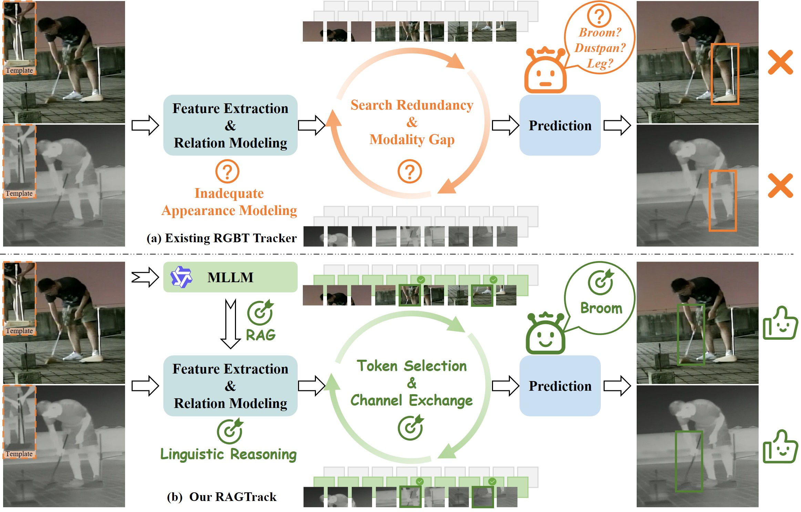
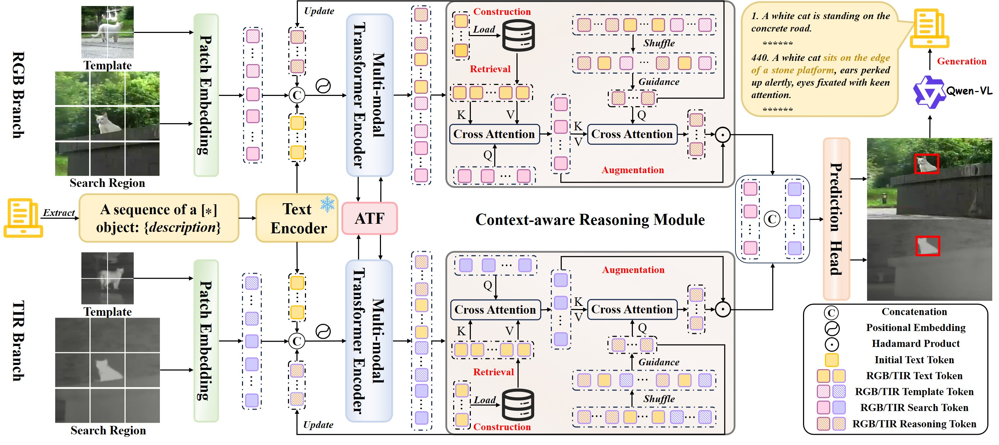
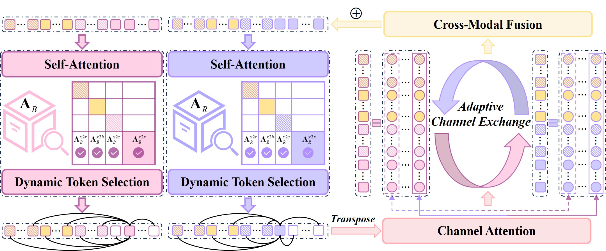

<p align="center">
  
  
  
</p>

<h1 align="center">
  <a href="https://arxiv.org/abs/2603.03617">RAGTrack: Language-aware RGBT Tracking<br>with Retrieval-Augmented Generation</a>
</h1>

<p align="center">
  <a href="https://cvpr.thecvf.com/virtual/2026/poster/37117"><strong>CVPR 2026</strong></a>
</p>

<p align="center">
  <a href="https://orcid.org/0009-0009-2668-7908">Hao Li</a>, 
  <a href="https://924973292.github.io/">Yuhao Wang</a>, 
  <a href="https://orcid.org/0000-0002-1526-7889">Wenning Hao</a>📧, 
  <a href="https://scholar.google.com/citations?user=MfbIbuEAAAAJ&hl=zh-CN">Pingping Zhang</a>📧, 
  <a href="https://scholar.google.com/citations?user=nVgPQpoAAAAJ&hl=zh-CN">Dong Wang</a>, 
  <a href="https://scholar.google.com/citations?user=D3nE0agAAAAJ&hl=zh-CN">Huchuan Lu</a>
</p>

<p align="center">
  <b>
    <a href="https://arxiv.org/abs/2603.03617">📄 Paper</a> &nbsp;|&nbsp;
    <a href="https://github.com/IdolLab/RAGTrack">💻 Code</a> &nbsp;|&nbsp;
    <a href="https://pan.baidu.com/s/1MiRG2wMaHMdNPo4-U52ENw?pwd=3ure">🤖 Models</a> &nbsp;|&nbsp;
    <a href="https://pan.baidu.com/s/1wE2XaOgTkcTIED6Xcma5VA?pwd=maa5">📊 Results</a> &nbsp;|&nbsp;
    <a href="#">📈 Benchmark</a>
  </b>
</p>

---

## 📝 Abstract

<p align="justify">
  This repository contains the official implementation of <strong>RAGTrack</strong>, the first language-aware RGBT tracking framework powered by Retrieval-Augmented Generation (RAG). We construct four RGB-T-L <a href="#">benchmarks</a> by introducing textual descriptions into GTOT, RGBT210, RGBT234, and LasHeR via MLLM-based annotation pipelines. We propose a novel framework consisting of a Multi-modal Transformer Encoder (MTE), Adaptive Token Fusion (ATF), and Context-aware Reasoning Module (CRM). Included are training/evaluation <a href="https://github.com/IdolLab/RAGTrack">codes</a>, <a href="https://pan.baidu.com/s/1MiRG2wMaHMdNPo4-U52ENw?pwd=3ure">models</a>, and <a href="https://pan.baidu.com/s/1wE2XaOgTkcTIED6Xcma5VA?pwd=maa5">results</a>.
</p>

---

## 🔥 Motivation

<p align="center">
  
  <br>
  <em>Figure 1. (a) Existing RGBT trackers suffer from inadequate appearance modeling, search redundancy, and modality gap. 
  (b) Our RAGTrack introduces linguistic reasoning, dynamic token selection, and adaptive channel exchange for robust tracking.</em>
</p>

---

## 🏗️ Framework

<p align="center">
  
  <br>
  <em>Figure 2. Overall framework of RAGTrack. MTE performs unified visual-language modeling, ATF dynamically selects target-relevant tokens and enables adaptive channel exchange, and CRM retrieves relevant contexts for context-aware reasoning.</em>
</p>

---

## 🔬 Adaptive Token Fusion (ATF)

<p align="center">
  
  <br>
  <em>Figure 3. Details of ATF. Dynamic token selection leverages text-guided attention scores to retain target-relevant tokens, while adaptive channel exchange bridges heterogeneous modality gaps.</em>
</p>

---

## ⚙️ Installation

**1. Clone the repository and create the conda environment:**

```bash
git clone https://github.com/IdolLab/RAGTrack.git
cd RAGTrack
conda create -n RAGTrack python=3.10
conda activate RAGTrack
```

**2. Download auxiliary models:**

- [CLIP](https://pan.baidu.com/s/1NREUlp9FJsK-FZV-SDDqgw?pwd=tea6) (pwd: `tea6`)
- [Qwen-VL](https://pan.baidu.com/s/) (pwd: `XXX`)

Place them under the appropriate paths (see [Setup & Configuration](#-setup--configuration)).

**3. Install dependencies:**

```bash
pip install -r requirements.txt
```

---

## 📁 Data Preparation

Download the following datasets and place them under `./data/`:

- **RGB-T images**: [GTOT, RGBT210, RGBT234, LasHeR](https://chenglongli.cn/Datasets-and-benchmark-code/)
- **Textual annotations**: [download](#) (pwd: `XXX`)

The expected directory structure is as follows:

RAGTrack/
└── data/
    ├── GTOT/
    │   ├── BlackCar/
    │   │   ├── i/
    │   │   ├── v/
    │   │   ├── groundTruth_i.txt
    │   │   ├── groundTruth_v.txt
    │   │   ├── visible_description.txt
    │   │   └── text.txt
    │   └── ...
    ├── RGBT210/
    │   ├── afterrain/
    │   │   ├── infrared/
    │   │   ├── visible/
    │   │   ├── init.txt
    │   │   ├── visible_description.txt
    │   │   └── text.txt
    │   └── ...
    ├── RGBT234/
    │   └── ...  (same structure as RGBT210)
    └── LasHeR/
        ├── train/
        │   ├── 1boygo/
        │   │   ├── infrared/
        │   │   ├── visible/
        │   │   ├── init.txt
        │   │   └── visible_description.txt
        │   └── ...
        └── test/
            ├── 1blackteacher/
            │   ├── infrared/
            │   ├── visible/
            │   ├── init.txt
            │   ├── visible_description.txt
            │   └── text.txt
            └── ...
```

---

## 🔧 Setup & Configuration

Run the following command to initialize local paths:

```bash
python tracking/create_default_local_file.py --workspace_dir . --data_dir ./data --save_dir ./output
```

Alternatively, manually edit the path configs:

```text
./lib/train/admin/local.py      # paths for training
./lib/test/evaluation/local.py  # paths for testing
```

---

## 🏋️ Training

**1. Download the pretrained backbone:**

Download the [pretrained model](https://pan.baidu.com/s/1MiRG2wMaHMdNPo4-U52ENw?pwd=3ure) (pwd: `3ure`) and place it under `./pretrained/`.

**2. Launch training:**

```bash
bash train.sh
```

> 💡 You can switch between different model variants by modifying the arguments in `train.sh`.

---

## 🚀 Testing

### Benchmark Evaluation

Download the [model](https://pan.baidu.com/s/1MiRG2wMaHMdNPo4-U52ENw?pwd=3ure) (pwd: `3ure`) and place it under `./output/`. Modify `<DATASET_PATH>` and `<SAVE_PATH>` in `./RGBT_workspace/test_rgbt_mgpus.py`, then run:

```bash
bash test.sh
```

### Evaluation Toolkit

For GTOT / RGBT210 / RGBT234 / LasHeR, please use the official [Evaluation Toolkit](https://chenglongli.cn/Datasets-and-benchmark-code/).

---

## 🖼️ Poster

<p align="center">
  
</p>

---

## 🙏 Acknowledgements

This repo is based on [UNTrack](https://github.com/q2479036243/MUSTMultispectral-UAV-Single-Object-Tracking) and [Qwen-VL](https://github.com/QwenLM/Qwen-VL). We sincerely thank the authors for their excellent works.

---

## 📚 Citation

If you find **RAGTrack** is helpful for your research, please consider citing:

```bibtex
@inproceedings{li2026ragtrack,
  title={RAGTrack: Language-aware RGBT Tracking with Retrieval-Augmented Generation},
  author={Li, Hao and Wang, Yuhao and Hao, Wenning and Zhang, Pingping and Wang, Dong and Lu, Huchuan},
  booktitle={Proceedings of the IEEE/CVF Conference on Computer Vision and Pattern Recognition (CVPR)},
  year={2026}
}
```

<p align="center"> <b>Star ⭐ this repo if you like our work!</b> </p>
